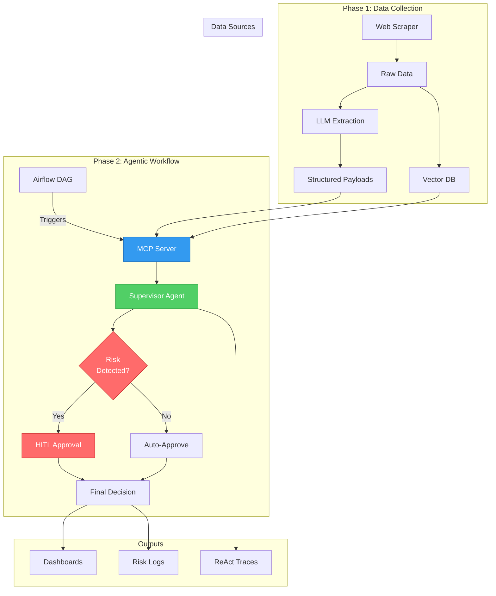

# Project ORBIT — PE Due Diligence Agentic System
## Agentification & MCP Integration for PE Dashboard (DAMG7245 - Assignment 5)

[](tests/)
[](https://python.org)
[](LICENSE)

An intelligent, production-ready PE due diligence system powered by LangChain agents, LangGraph workflows, and the Model Context Protocol (MCP).

## 🎯 Overview

Project ORBIT transforms traditional PE dashboard generation into an **agentic, automated workflow** with:

- 🤖 **LangChain Agents**: Supervisor, Planner, and Evaluator agents with ReAct reasoning
- 🔄 **LangGraph Workflows**: Graph-based orchestration with conditional branching
- 🌐 **MCP Server**: Standardized tool/resource/prompt exposure via HTTP
- 🚨 **HITL Integration**: Human-in-the-loop approval for high-risk companies
- 📊 **Airflow DAGs**: Scheduled workflows for initial load, daily updates, and agentic dashboards
- 🐳 **Docker Deployment**: Full containerization with docker-compose

---

## 🏗️ System Architecture



---

## ✨ Key Features

### Phase 1 - Agent Infrastructure (Labs 12-13) ✅
- 3 core agent tools with async support
- Pydantic models for structured I/O
- Supervisor Agent with ReAct pattern
- Structured JSON logging with correlation IDs
- 10 unit tests (100% passing)

### Phase 2 - MCP Integration (Labs 14-15) ✅
- MCP Server with 6 HTTP endpoints
- Dashboard generation tools (structured + RAG)
- Company resources and prompt templates
- Docker support with health checks
- 11 integration tests (100% passing)

### Phase 3 - Advanced Workflows (Labs 16-18) ✅
- LangGraph StateGraph with 7 nodes
- Conditional branching (HITL vs Auto-Approve)
- Risk keyword detection (11 keywords)
- Interactive CLI pause/resume for HITL
- 16 workflow tests (100% passing)

### Phase 4 - Orchestration & Deployment ✅
- 3 Airflow DAGs (initial load, daily update, agentic dashboard)
- Docker Compose for full stack deployment
- Configuration management (YAML + .env)
- Production-ready logging and monitoring

---

## 🚀 Quick Start

### Prerequisites

- Python 3.13+
- Docker & Docker Compose (optional)
- OpenAI API Key
- Pinecone API Key (optional)

### Option 1: Local Setup

```bash
# 1. Clone repository
git clone <your-repo-url>
cd pe-dashboard-ai50-v3

# 2. Create virtual environment
python -m venv .venv
source .venv/bin/activate  # Windows: .venv\Scripts\activate

# 3. Install dependencies
pip install -r requirements.txt

# 4. Configure environment
cp .env.example .env
# Edit .env with your API keys

# 5. Run MCP Server (Terminal 1)
 python -m src.server.mcp_server

# 6. Run Workflow (Terminal 2)
PYTHONPATH=. python3 src/workflows/due_diligence_graph.py anthropic

# 7. Run Tests
PYTHONPATH=. pytest -v
```

### Option 2: Docker Setup

```bash
# 1. Configure environment
cp .env.example .env
# Edit .env with your API keys

# 2. Start all services
docker-compose up --build

# 3. Check health
curl http://localhost:9000/health

# 4. Stop services
docker-compose down
```

---

## 📋 Usage Examples

### Run Due Diligence Workflow

```bash
# Interactive mode (requires human approval for risky companies)
PYTHONPATH=. HITL_AUTO_APPROVE=false python3 src/workflows/due_diligence_graph.py anthropic

# Auto-approve mode (for automation)
PYTHONPATH=. HITL_AUTO_APPROVE=true python3 src/workflows/due_diligence_graph.py openai
```

### Call MCP Server Directly

```bash
# Health check
curl http://localhost:9000/health

# Get company list
curl http://localhost:9000/resource/ai50/companies

# Generate dashboard
curl -X POST http://localhost:9000/tool/generate_structured_dashboard \
  -H "Content-Type: application/json" \
  -d '{"company_id": "anthropic"}'
```

### Run Airflow DAGs

```bash
# Trigger initial load
airflow dags trigger orbit_initial_load

# Trigger agentic dashboard generation
airflow dags trigger orbit_agentic_dashboard

# Check status
airflow dags state orbit_agentic_dashboard <execution_date>
```

---

## 🧪 Testing

```bash
# Run all tests
PYTHONPATH=. pytest -v

# Run specific test suite
PYTHONPATH=. pytest tests/test_tools.py -v
PYTHONPATH=. pytest tests/test_mcpserver.py -v
PYTHONPATH=. pytest tests/test_workflow_branches.py -v

# Run with coverage
PYTHONPATH=. pytest --cov=src --cov-report=html
```

**Test Results**: ✅ 37/37 tests passing (100%)

---

## 📁 Project Structure

```
pe-dashboard-ai50-v3/
├── src/
│   ├── agents/
│   │   ├── supervisor_agent.py       # Main supervisor with ReAct
│   │   ├── planner_agent.py          # Plan generation
│   │   └── evaluation_agent.py       # Dashboard evaluation
│   ├── tools/
│   │   ├── payload_tool.py           # Payload retrieval
│   │   ├── rag_tool.py               # Vector DB search
│   │   └── risk_logger.py            # Risk signal logging
│   ├── workflows/
│   │   └── due_diligence_graph.py    # LangGraph workflow
│   ├── server/
│   │   └── mcp_server.py             # MCP HTTP server
│   ├── utils/
│   │   ├── react_logger.py           # ReAct trace logger
│   │   └── dashboard_generator.py    # Dashboard generation
│   └── models.py                      # Pydantic models
├── tests/
│   ├── test_tools.py                  # Tool unit tests
│   ├── test_mcpserver.py              # MCP integration tests
│   └── test_workflow_branches.py      # Workflow branch tests
├── airflow/
│   └── dags/
│       └── orbig_agentic_dashboard_dag.py
├── config/
│   ├── mcp_config.json                # MCP client config
│   └── settings_example.yaml          # Application settings
├── data/                               # Runtime data
├── logs/                               # Log files
├── docker-compose.yml                 # Full stack orchestration
├── .env.example                        # Environment template
├── requirements.txt                    # Python dependencies
├── Dockerfile.mcp                 
├── Dockerfile.agent                
├── Dockerfile.airflow                
└── README.md                           # This file
```

---

## 🔧 Configuration

### Environment Variables (.env)

```bash
# API Keys
OPENAI_API_KEY=your_key_here
PINECONE_API_KEY=your_key_here

# MCP Server
MCP_BASE_URL=http://localhost:9000
MCP_PORT=9000

# Agent Config
AGENT_MODEL=gpt-4o-mini
AGENT_TEMPERATURE=0

# HITL Config
HITL_AUTO_APPROVE=false  # Set to true for automation
```

### Application Settings (config/settings.yaml)

Copy `config/settings_example.yaml` to `config/settings.yaml` and customize:

- API endpoints and keys
- Workflow configuration
- Risk detection keywords
- Logging levels
- Performance tuning

---

## 📊 Workflow Execution

### No-Risk Path (Auto-Approve)

```
START → Planner → Data Generator → Evaluator → Risk Detector
        → Auto-Approve → Final Decision → END

Duration: ~2-5 seconds
```

### Risk Path (HITL Required)

```
START → Planner → Data Generator → Evaluator → Risk Detector
        → HITL (Human Approval) → Final Decision → END

Duration: Variable (depends on human response time)
```

---

## 🐛 Troubleshooting

### MCP Server Not Starting

```bash
# Check if port 9000 is in use
lsof -i :9000

# Kill process using port
kill -9 <PID>

# Restart MCP server
uvicorn src.server.mcp_server:app --port 9000
```

### Workflow Hangs During HITL

```bash
# Set auto-approve mode
export HITL_AUTO_APPROVE=true

# Or run with environment variable
HITL_AUTO_APPROVE=true python3 src/workflows/due_diligence_graph.py anthropic
```

### Tests Failing

```bash
# Ensure PYTHONPATH is set
export PYTHONPATH=.

# Set HITL auto-approve for tests
export HITL_AUTO_APPROVE=true

# Run tests
pytest -v
```

---

## 📈 Metrics & Performance

- **Total Lines of Code**: ~5,700 lines
- **Test Coverage**: 37 tests, 100% passing
- **MCP Endpoints**: 6 endpoints
- **Workflow Nodes**: 7 nodes
- **Risk Keywords**: 11 monitored keywords
- **Airflow DAGs**: 3 DAGs

---


## 📄 License

MIT License - See [LICENSE](LICENSE) for detail

---

## 👥 Team

- **Course**: DAMG7245 - Big Data Systems & Intelligence Analytics
- **Assignment**: Assignment 5 - Project ORBIT Part 2
- **Institution**: Northeastern University

---

## Acknowledgments

- LangChain & LangGraph for agent frameworks
- Model Context Protocol (MCP) specification
- Apache Airflow for orchestration
- OpenAI & Pinecone for AI infrastructure

---


**Last Updated**: November 16, 2025