# Workflow Graph — Due Diligence LangGraph Implementation

## Overview

This document describes the graph-based workflow for PE due diligence using **LangGraph**. The workflow implements a supervisory pattern with conditional branching based on risk detection, supporting both automated approval and Human-in-the-Loop (HITL) review.

---

## Workflow Architecture

```mermaid
flowchart TD
    START([Start]) --> PLANNER[📋 Planner Node]

    PLANNER --> |Plan Created| DATA_GEN[🔧 Data Generator Node]

    DATA_GEN --> |Dashboards Generated| EVAL[📊 Evaluator Node]

    EVAL --> |Scores Calculated| RISK[⚠️ Risk Detector Node]

    RISK --> |Check for Risk Keywords| DECISION{Risk Detected?}

    DECISION --> |Yes - High Risk| HITL[🚨 HITL Node<br/>Human Approval Required]
    DECISION --> |No - Safe| AUTO[✅ Auto-Approve Node]

    HITL --> |Approved/Rejected| FINAL[📝 Final Decision Node]
    AUTO --> FINAL

    FINAL --> END([End])

    style START fill:#e1f5e1
    style END fill:#ffe1e1
    style PLANNER fill:#e3f2fd
    style DATA_GEN fill:#fff3e0
    style EVAL fill:#f3e5f5
    style RISK fill:#ffebee
    style DECISION fill:#fff9c4
    style HITL fill:#ffcdd2
    style AUTO fill:#c8e6c9
    style FINAL fill:#b3e5fc
```



---

## Node Descriptions

### 1. Planner Node 📋
**Purpose**: Constructs a plan of actions for due diligence

**Responsibilities**:
- Analyzes company_id and determines workflow steps
- Creates structured plan with action items
- Logs plan creation via ReAct logger

**Output**: `plan` (dict with "steps" array)

**Implementation**: `src/agents/planner_agent.py:plan_due_diligence()`

---

### 2. Data Generator Node 🔧
**Purpose**: Invokes MCP dashboard tools to generate dashboards

**Responsibilities**:
- Calls `generate_structured_dashboard` MCP tool
- Calls `generate_rag_dashboard` MCP tool
- Handles MCP failures with fallback stub dashboards
- Logs all tool invocations

**Output**:
- `structured_dashboard` (markdown string)
- `rag_dashboard` (markdown string)

**MCP Tools Used**:
- `POST /tool/generate_structured_dashboard`
- `POST /tool/generate_rag_dashboard`

---

### 3. Evaluator Node 📊
**Purpose**: Scores dashboards per PE rubric

**Responsibilities**:
- Evaluates both structured and RAG dashboards
- Scores across 5 dimensions:
  - **Factual**: Factual accuracy
  - **Schema**: Schema compliance (8 sections)
  - **Provenance**: Source attribution
  - **Hallucination**: Hallucination risk (lower is better)
  - **Readability**: Markdown formatting quality
- Determines winner dashboard

**Output**: `evaluation_result` (dict with "winner" and "scores")

**Rubric Dimensions** (0-3 scale):
- 0 = Poor
- 1 = Fair
- 2 = Good
- 3 = Excellent

**Implementation**: `src/agents/evaluation_agent.py:evaluate_dashboards()`

---

### 4. Risk Detector Node ⚠️
**Purpose**: Scans dashboards for risk keywords and determines if HITL is needed

**Responsibilities**:
- Scans both dashboards for risk keywords (case-insensitive)
- Sets `risk_detected` flag
- Populates `risk_keywords` array
- Determines `hitl_required` flag

**Risk Keywords Monitored**:
- Workforce: `layoff`, `layoffs`, `workforce reduction`
- Security: `breach`, `data breach`, `security breach`
- Legal: `lawsuit`, `litigation`
- Financial: `fraud`, `fraudulent`, `bankruptcy`, `chapter 11`
- Reputation: `controversy`, `controversial`

**Output**:
- `risk_detected` (boolean)
- `risk_keywords` (array of detected keywords)
- `hitl_required` (boolean)

---

### 5a. HITL Node 🚨
**Purpose**: Pauses workflow for human approval when risks are detected

**Responsibilities**:
- Displays risk summary to human reviewer
- Shows detected keywords and company details
- **Lab 17**: Simulates auto-approval
- **Lab 18**: Implements actual CLI/HTTP pause-resume

**Trigger**: `risk_detected == True`

**Output**: `hitl_approved` (boolean)

**Future Enhancements** (Lab 18):
- CLI pause with `input()` prompt
- HTTP endpoint for async approval
- Integration with notification systems (email, Slack)

---

### 5b. Auto-Approve Node ✅
**Purpose**: Automatically approves when no risks detected

**Responsibilities**:
- Sets approval flag without human intervention
- Logs auto-approval decision
- Continues to final decision

**Trigger**: `risk_detected == False`

**Output**: `hitl_approved = True`

---

### 6. Final Decision Node 📝
**Purpose**: Summarizes workflow results and makes final recommendation

**Responsibilities**:
- Aggregates all workflow data
- Creates final decision JSON with:
  - `company_id`, `run_id`, `timestamp`
  - `execution_path` (array of nodes executed)
  - `risk_detected`, `risk_keywords`
  - `hitl_required`, `hitl_approved`
  - `evaluation_winner`
  - `recommendation` ("APPROVED" or "REJECTED")
  - `errors` (array of errors encountered)
- Logs final answer via ReAct logger

**Output**: `final_decision` (JSON string)

---

## Conditional Routing Logic

### Router Function: `route_after_risk_detection()`

```python
def route_after_risk_detection(state: DueDiligenceState) -> Literal["hitl", "auto_approve"]:
    """
    Determines workflow branch based on risk detection

    Returns:
        "hitl" if risks detected → Human review required
        "auto_approve" if no risks → Automated approval
    """
    if state["risk_detected"]:
        return "hitl"
    else:
        return "auto_approve"
```

**Decision Matrix**:

| Risk Detected | Route | Human Involvement |
|---------------|-------|-------------------|
| `True` | HITL Node | Required |
| `False` | Auto-Approve Node | None |

---

## State Schema

### `DueDiligenceState` (TypedDict)

```python
{
    # Identifiers
    "company_id": str,
    "run_id": str,

    # Plan
    "plan": dict | None,

    # Generated Dashboards
    "structured_dashboard": str | None,
    "rag_dashboard": str | None,

    # Evaluation
    "evaluation_result": dict | None,

    # Risk Detection
    "risk_detected": bool,
    "risk_keywords": list[str],

    # HITL
    "hitl_required": bool,
    "hitl_approved": bool | None,

    # Final Output
    "final_decision": str | None,

    # Metadata
    "execution_path": list[str],  # Tracks nodes executed
    "errors": list[str]           # Captures errors
}
```

---

## Execution Paths

### Path 1: No-Risk Flow (Auto-Approve)

```
START
  → Planner
  → Data Generator
  → Evaluator
  → Risk Detector
  → Auto-Approve
  → Final Decision
  → END
```

**Example execution_path**:
```json
["planner", "data_generator", "evaluator", "risk_detector", "auto_approve", "final_decision"]
```

**Characteristics**:
- No risk keywords found in dashboards
- Automated approval (no human intervention)
- Fast execution (~2-5 seconds)

---

### Path 2: Risk Flow (HITL)

```
START
  → Planner
  → Data Generator
  → Evaluator
  → Risk Detector
  → HITL
  → Final Decision
  → END
```

**Example execution_path**:
```json
["planner", "data_generator", "evaluator", "risk_detector", "hitl", "final_decision"]
```

**Characteristics**:
- Risk keywords detected (layoffs, breach, lawsuit, etc.)
- Human approval required
- Pauses execution until approval (Lab 18)
- Slower execution (~variable, depends on human response time)

---

### Path 3: Fallback Flow (MCP Failure)

```
START
  → Planner
  → Data Generator (MCP fails → stub dashboards)
  → Evaluator
  → Risk Detector
  → Auto-Approve
  → Final Decision
  → END
```

**Example execution_path**:
```json
["planner", "data_generator_fallback", "evaluator", "risk_detector", "auto_approve", "final_decision"]
```

**Characteristics**:
- MCP server unavailable or timeout
- Uses stub dashboards (minimal markdown)
- Continues workflow with degraded data
- Errors logged in `state["errors"]`

---

## Usage

### Running the Workflow

#### CLI Execution
```bash
# Basic usage
PYTHONPATH=. python3 src/workflows/due_diligence_graph.py anthropic

# With custom run_id
PYTHONPATH=. python3 src/workflows/due_diligence_graph.py anthropic my-custom-run-123
```

#### Programmatic Usage
```python
from src.workflows.due_diligence_graph import run_workflow

# Run workflow
final_state = run_workflow(company_id="anthropic", run_id="test-run-001")

# Check results
print(f"Branch taken: {'HITL' if final_state['hitl_required'] else 'Auto-Approve'}")
print(f"Execution path: {final_state['execution_path']}")
print(f"Final decision: {final_state['final_decision']}")
```

---

## Checkpointing & Persistence

### Memory Saver

The workflow uses **LangGraph's MemorySaver** for checkpointing:

```python
from langgraph.checkpoint.memory import MemorySaver

memory = MemorySaver()
app = graph.compile(checkpointer=memory)
```

**Benefits**:
- State is preserved between node executions
- Workflow can be paused and resumed (critical for HITL)
- Execution history is maintained
- Thread-safe for concurrent workflows

**Configuration**:
```python
config = {"configurable": {"thread_id": run_id}}
```

Each workflow execution gets a unique `thread_id` (derived from `run_id`).

---

## Testing

### Unit Tests

Located in: `tests/test_workflow_branches.py`

**Test Coverage**:
- ✅ Individual node tests (planner, evaluator, risk detector, etc.)
- ✅ Conditional routing tests
- ✅ No-risk branch end-to-end test
- ✅ Risk branch end-to-end test
- ✅ MCP failure fallback test
- ✅ Full integration test (both branches)

**Run Tests**:
```bash
PYTHONPATH=. pytest tests/test_workflow_branches.py -v
```

**Expected Result**: 16/16 tests passing

---

## Lab 17 Checkpoint Validation ✅

**Requirement**: `python src/workflows/due_diligence_graph.py` prints branch taken

**Output Example**:
```
============================================================
🚀 STARTING DUE DILIGENCE WORKFLOW
============================================================
Company ID: anthropic
Run ID: abc-123-def-456
============================================================

📍 Completed node: planner
📍 Completed node: data_generator
📍 Completed node: evaluator
📍 Completed node: risk_detector

🚨 HUMAN-IN-THE-LOOP CHECKPOINT
============================================================
Company: anthropic
Run ID: abc-123-def-456
Risk Keywords Detected: layoffs, breach
============================================================

📍 Completed node: hitl
📍 Completed node: final_decision

============================================================
✅ WORKFLOW COMPLETE
============================================================
Execution Path: planner → data_generator → evaluator → risk_detector → hitl → final_decision
Branch Taken: HITL
============================================================
```

**Verification**:
- ✅ Workflow executes without errors
- ✅ Console shows branch taken (HITL or Auto-Approve)
- ✅ Execution path logged
- ✅ ReAct traces written to `logs/react_traces.jsonl`

---

## Integration with Other Components

### Supervisor Agent
- Supervisor can invoke the workflow programmatically
- Shares same ReAct logger for unified traces
- Uses same MCP client for tool calls

### MCP Server
- Data Generator node calls MCP tools
- Requires MCP server running on port 9000
- Graceful fallback if MCP unavailable

### ReAct Logger
- All nodes log Thought/Action/Observation
- Correlation IDs maintained (`run_id`, `company_id`)
- Traces written to `logs/react_traces.jsonl`

---

## Future Enhancements (Lab 18)

### HITL Pause/Resume Implementation

**CLI Pause**:
```python
# In hitl_node()
approval = input("Approve this company? (yes/no): ")
state["hitl_approved"] = (approval.lower() == "yes")
```

**HTTP Pause** (async):
```python
# Pause workflow, return run_id to caller
# Store state in database/Redis
# Resume when approval received via POST /approve/{run_id}
```

**Notification Integration**:
- Send email/Slack when HITL required
- Include risk summary and approval link
- Track approval latency metrics

---

## Performance Considerations

### Execution Time

| Path | Typical Duration | Bottleneck |
|------|------------------|------------|
| No-Risk | 2-5 seconds | MCP dashboard generation |
| Risk (simulated) | 3-6 seconds | Same as above |
| Risk (Lab 18) | Variable | Human response time (minutes/hours) |
| MCP Failure | 1-2 seconds | Stub generation (fast) |

### Optimization Strategies

1. **Parallel Dashboard Generation**: Generate structured + RAG dashboards concurrently
2. **Caching**: Cache dashboards for recent companies (TTL: 1 hour)
3. **Async MCP Calls**: Use `asyncio.gather()` for concurrent tool calls
4. **Lazy Evaluation**: Only evaluate winner dashboard (skip loser)
5. **Risk Keyword Indexing**: Pre-compile regex for faster matching

---

## Monitoring & Observability

### Key Metrics

1. **Workflow Success Rate**: `(successful_workflows / total_workflows) * 100`
2. **HITL Trigger Rate**: `(hitl_workflows / total_workflows) * 100`
3. **Approval Rate**: `(approved_workflows / hitl_workflows) * 100`
4. **Average Execution Time**: By path (no-risk, risk, fallback)
5. **Error Rate**: `(workflows_with_errors / total_workflows) * 100`

### Logging

All logs include:
- `run_id`: Unique workflow identifier
- `company_id`: Entity being analyzed
- `timestamp`: ISO 8601 UTC
- `step`: Sequential step number
- `type`: thought, action, observation, final_answer

**Log File**: `logs/react_traces.jsonl`

---

## Troubleshooting

### Common Issues

#### 1. MCP Server Unavailable
**Symptoms**: All workflows take fallback path
**Solution**: Start MCP server: `uvicorn src.server.mcp_server:app --port 9000`

#### 2. No Risk Detected (False Negative)
**Symptoms**: Workflow auto-approves despite risks
**Solution**: Review risk keyword list, add domain-specific terms

#### 3. Too Many HITL Triggers (False Positive)
**Symptoms**: Every workflow requires human approval
**Solution**: Refine risk keywords, add context-aware filtering

#### 4. Workflow Hangs
**Symptoms**: Workflow doesn't complete
**Solution**: Check for errors in logs, verify MCP server health

---

## References

- [LangGraph Documentation](https://python.langchain.com/docs/langgraph)
- [LangGraph Checkpointing](https://python.langchain.com/docs/langgraph/how-tos/persistence)
- [ReAct Pattern Paper](https://arxiv.org/abs/2210.03629)
- Assignment 5 - Lab 17 Requirements

---

**Status**: ✅ **Lab 17 Complete**
**Date**: November 16, 2025
**Next**: Lab 18 - HITL CLI/HTTP Pause Implementation
